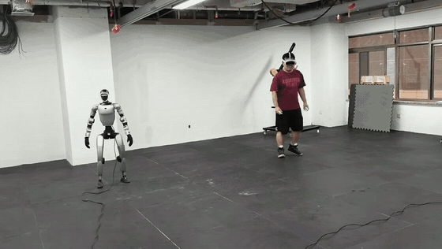

# GRIT

[中文文档](README_ZH.md)

This repository provides Unitree G1 deployment code for GRIT v0.0.1, a
whole-body motion-tracking control algorithm for humanoid robots. The policy
inference process communicates through a unified UDP interface, enabling the
robot to track an operator's full-body motion using PICO.

This repository includes:

- the GRIT ONNX policy and its deployment contract
- a 50 Hz Python inference and control runtime
- headless and interactive MuJoCo sim2sim
- PICO/XRoboToolkit live-motion retargeting
- a native Unitree SDK2 hardware bridge with a stale-command watchdog

Training and data-generation code are outside the scope of this repository.

## Teleoperation Demo



## TODO List

1. **August 29: GRIT v0.0.1**: Release the initial policy checkpoint, together
   with complete pipelines for sim2sim, local sim2real deployment, and VR
   teleoperation.
2. **September: GRIT v0.0.2**: Release an updated policy checkpoint and its
   technical documentation, along with an on-device deployment pipeline,
   hardware modification plans for the head and hands, and a VLA data
   collection pipeline.
3. **October: GRIT v1.0.0**: Officially release the general-purpose motion
   foundation model, including a technical report (paper), an integrated
   checkpoint, the training dataset, framework, and source code, plus a tutorial
   on integrating VLA data collection and training.

## Repository layout

```text
.
├── sim2real/
│   ├── checkpoints/                 # GRIT ONNX model and runtime contract
│   ├── config/g1/
│   │   ├── motions/                 # example reference motions
│   │   ├── tracking.yaml            # local reference-motion mode
│   │   ├── tracking_vr.yaml         # live PICO mode
│   │   ├── controller.yaml          # policy loop, gains, and joint order
│   │   ├── bridge.yaml              # MuJoCo UDP bridge settings
│   │   └── retarget/teleop.yaml     # PICO retargeting and browser-viewer settings
│   ├── src/
│   │   ├── deploy.py                # GRIT inference and control entry point
│   │   ├── sim2sim.py               # MuJoCo robot process
│   │   └── runtime/
│   │       ├── grit_policy.py       # GRIT ONNX/action contract
│   │       └── grit_observation.py  # GRIT observation construction
│   ├── teleop/                      # XR stream, G1 retargeting, and port-8080 viewer
│   └── tests/test_grit_contract.py
├── g1_sim2real/                     # native Unitree SDK2 bridge
├── THIRD_PARTY.md
└── LICENSE
```

## Requirements

- Ubuntu 22.04 or 24.04 on `x86_64` or `aarch64`
- Python 3.10 and [uv](https://docs.astral.sh/uv/)
- CMake 3.16+, a C++17 compiler, `make`, and `flock`
- a working MuJoCo graphics stack for the interactive simulator
- XRoboToolkit, its Python SDK, and low-latency Wi-Fi shared with the workstation
  for PICO control
- a Unitree G1 and a dedicated robot-facing network interface for hardware use

Install the Python environment from the repository root:

```bash
cd sim2real
uv sync
cd ..
```

## Quick start: MuJoCo

Run the simulator in terminal 1:

```bash
cd sim2real
uv run src/sim2sim.py --robot g1
```

Run GRIT in terminal 2:

```bash
cd sim2real
uv run src/deploy.py \
  --robot g1 \
  --tracking-config tracking.yaml \
  --policy-path checkpoints/policy.onnx
```

Press `s` in the GRIT terminal to move to the default pose. Then press `a` in
the simulator terminal to enable policy control. Press `x` to stop.

`tracking.yaml` loops `config/g1/motions/walk_turn.npz` by default. Override it
with another GRIT-compatible reference:

```bash
cd sim2real
uv run src/deploy.py \
  --robot g1 \
  --motion-file /path/to/reference.npz \
  --policy-path checkpoints/policy.onnx
```

For a finite headless smoke run, start both processes with automatic controls:

```bash
# terminal 1
cd sim2real
uv run src/sim2sim.py \
  --robot g1 --headless --auto-start --max-control-seconds 10
```

```bash
# terminal 2
cd sim2real
uv run src/deploy.py \
  --robot g1 --auto-start --max-policy-steps 500
```

## PICO setup

If you have not configured the PICO software, follow this guide first: [PICO hardware, XRoboToolkit, calibration, and network setup guide](docs/pico_setup.md)

Install the XRoboToolkit PC service at `/opt/apps/roboticsservice`, then install
its Python binding into the GRIT environment:

```bash
cd sim2real
bash install_xrobottoolkit_sdk.sh
```

The Python binding is installed separately from the packages managed by `uv`.
After installing it, use `uv sync --inexact` for later environment syncs so the
binding is retained.

This repository supports PICO teleoperation over Wi-Fi only. Start the
XRoboToolkit PC Service:

```bash
bash /opt/apps/roboticsservice/runService.sh
```

Find the workstation's Wi-Fi IPv4 address and enter it as `PC Service` in the
XRoboToolkit headset client. Do not use `127.0.0.1`, a container address, or the
dedicated G1 network-interface address. The headset must display `WORKING`, with
`Head`, `Controller`, `Send`, and `Full body` enabled.

Start the retargeting process with:

```bash
cd sim2real
taskset -c 1 uv run teleop/serve_xrobot_teleop.py --robot g1
```

The retargeting process also starts the browser viewer by default. Open
<http://localhost:8080> on the workstation to inspect the human pose and the
retargeted G1. Other devices on the same LAN can use
`http://<workstation-wifi-ip>:8080`.

The live control pipeline uses TCP ports `28701`, `28702`, and `28703`; the
browser viewer uses TCP port `8080`.

If the listed CPU IDs are unavailable on the workstation, omit the
`taskset -c ...` prefix. CPU affinity is an optimization, not a functional
requirement.

## PICO sim2sim

Start the following processes in order:

```bash
# terminal 1: PICO retargeting
cd sim2real
taskset -c 1 uv run teleop/serve_xrobot_teleop.py --robot g1
```

```bash
# terminal 2: MuJoCo
cd sim2real
uv run src/sim2sim.py --robot g1
```

```bash
# terminal 3: GRIT control
cd sim2real
taskset -c 4-7 uv run src/deploy.py \
  --robot g1 \
  --tracking-config tracking_vr.yaml \
  --policy-path checkpoints/policy.onnx
```

Press `s` in terminal 3 before activating live control.

| PICO input | Behavior |
| --- | --- |
| Left `X` | Activate GRIT, then return to the default standing pose |
| Right `A` | Start or resume live motion |
| Left `Y` | Stop the controller |

## G1 hardware deployment

First validate the exact model, configuration, and PICO flow in MuJoCo. Build
the native bridge once:

```bash
cd g1_sim2real
bash scripts/build.sh
cd ..
```

Secure or suspend the robot, keep an operator at the emergency stop, and replace
`enp129s0` below with the interface connected to the G1.

```bash
# terminal 1: PICO retargeting
cd sim2real
taskset -c 1 uv run teleop/serve_xrobot_teleop.py --robot g1
```

```bash
# terminal 2: Unitree bridge
cd g1_sim2real
G1_NET=enp129s0 taskset -c 2-3 bash scripts/run_bridge.sh
```

```bash
# terminal 3: GRIT control
cd sim2real
taskset -c 4-7 uv run src/deploy.py \
  --robot g1 \
  --tracking-config tracking_vr.yaml \
  --policy-path checkpoints/policy.onnx
```

Press `s` only after the GRIT process reports valid robot state. Verify the
joint order, gains, default pose, network interface, and model hash before
releasing physical support.

The native bridge keeps Unitree's motion service active until it receives a
valid Python command. After handoff, a stale or missing command stream switches
the bridge to continuous damping after `0.2 s` by default. This watchdog is not
a substitute for a physical emergency stop or a tested recovery procedure.

## GRIT model contract

The bundled files are:

```text
sim2real/checkpoints/policy.onnx
sim2real/checkpoints/policy.json
```

The ONNX graph must expose this exact interface:

| Name | Direction | Shape |
| --- | --- | --- |
| `reference_context` | input | `[batch, 9, 70]` |
| `proprio_history` | input | `[batch, 990]` |
| `actions` | output | `[batch, 29]` |

The runtime rejects incompatible input or output names. See
`sim2real/checkpoints/README.md` for checksums and replacement guidance.

Reference NPZ files use the GRIT motion contract: `fps`, `joint_pos`,
`joint_vel`, `body_pos_w`, `body_quat_w`, `body_lin_vel_w`, and
`body_ang_vel_w`.

## Validation

Run the GRIT deployment contract tests:

```bash
cd sim2real
uv run python tests/test_grit_contract.py -q
```

Build-check the native bridge:

```bash
cd g1_sim2real
bash scripts/build.sh
```

## Notes

The model in this release is a beta trained on only 10+ hours of open-source
data. It can track most reference trajectories, but we recommend operating the
robot with an overhead safety rig and exercising extreme caution.

## License

GRIT deployment code is released under the MIT License. Vendored dependencies,
robot assets, and XRoboToolkit components retain their own terms; see
`THIRD_PARTY.md`.
