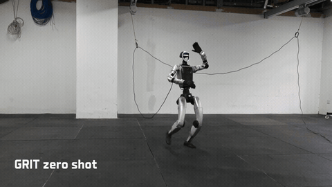
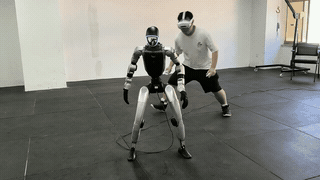
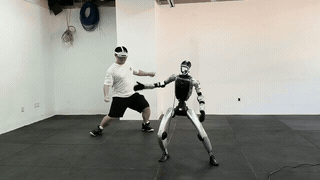
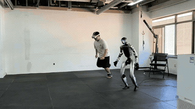
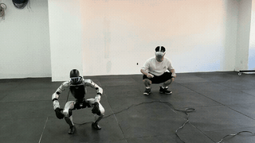

# GRIT

[English](README.md)

本仓库是面向人形机器人全身跟踪运动控制算法GRIT v0.0.1 的Unitree G1 部署代码。策略推理进程通过统一的 UDP 接口，使用PICO即可实现人和机器人的全身运动跟踪控制。

> **致谢：** 本仓库的部分部署实现参考并改写自
> [`Axellwppr/motion_tracking` 的 `sim2real` 分支](https://github.com/Axellwppr/motion_tracking/tree/sim2real)。
> 上游项目版权声明为 Copyright (c) 2026 Axell，并采用
> [MIT License](https://github.com/Axellwppr/motion_tracking/blob/sim2real/LICENSE)。
> 感谢原作者及贡献者公开相关实现。

本仓库包含：

- GRIT ONNX 策略及其配置文件
- 50 Hz Python 推理与控制环路
- 支持无界面和交互界面的 MuJoCo sim2sim
- 基于 PICO/XRoboToolkit 的实时动作重定向
- 基于 Unitree SDK2 的原生硬件桥接，包含指令超时监测和键盘急停

训练和数据生成代码不在本部署仓库的范围内。

## 轨迹跟踪泛化演示

<p align="center">
  
</p>

## 遥操作演示

<p align="center">
  
  
</p>
<p align="center">
  
  
</p>

## TODO List

1. **8 月 29 日：GRIT v0.0.1**：开源首版策略 checkpoint，同时发布
   sim2sim、本地 sim2real 部署和 VR 遥操作的完整链路。
2. **9 月：GRIT v0.0.2**：开源新版策略 checkpoint 和配套技术文档，同时发布
   端侧部署链路、头部/手部/相机的硬件改装方案，以及 VLA 数据采集链路。
3. **10 月：GRIT v1.0.0**：正式发布通用运动基础模型，包括技术报告（论文）、
   功能整合版 checkpoint、训练数据集、训练框架及代码，并提供 VLA 数据采集与
   训练接入教程。

## 仓库结构

```text
.
├── sim2real/
│   ├── checkpoints/                 # GRIT ONNX 模型及配置文件
│   ├── config/g1/
│   │   ├── motions/                 # 示例参考动作
│   │   ├── tracking.yaml            # 本地参考动作模式
│   │   ├── tracking_vr.yaml         # PICO 实时控制模式
│   │   ├── controller.yaml          # 策略频率、增益和关节顺序
│   │   ├── bridge.yaml              # MuJoCo UDP 桥接配置
│   │   └── retarget/teleop.yaml     # PICO 重定向与浏览器可视化配置
│   ├── src/
│   │   ├── deploy.py                # GRIT 推理与控制入口
│   │   ├── sim2sim.py               # MuJoCo 机器人进程
│   │   └── runtime/
│   │       ├── grit_policy.py       # GRIT ONNX 和动作契约
│   │       └── grit_observation.py  # GRIT 观测构造
│   ├── teleop/                      # XR 数据流、G1 重定向和 8080 Web viewer
│   └── tests/test_grit_contract.py
├── g1_sim2real/                     # Unitree SDK2 原生硬件桥接器
├── THIRD_PARTY.md
└── LICENSE
```

## 环境要求

- `x86_64` 或 `aarch64` 架构的 Ubuntu 22.04/24.04
- Python 3.10 和 [uv](https://docs.astral.sh/uv/)
- CMake 3.16+、支持 C++17 的编译器、`make` 和 `flock`
- 运行交互式仿真所需的 MuJoCo 图形环境
- 使用 PICO 时需要 XRoboToolkit、Python SDK，以及与工作站同一局域网的低延迟 Wi-Fi
- 真机部署需要 Unitree G1 和本地电脑通过网线连接

在仓库根目录安装 Python 环境：

```bash
cd sim2real
uv sync
cd ..
```

## 快速开始：MuJoCo

在终端 1 启动仿真器：

```bash
cd sim2real
uv run src/sim2sim.py --robot g1
```

在终端 2 启动 GRIT：

```bash
cd sim2real
uv run src/deploy.py \
  --robot g1 \
  --tracking-config tracking.yaml \
  --policy-path checkpoints/policy.onnx
```

在 GRIT 终端（终端 2）按 `s` 进入运控默认站姿，再在同一终端按 `a`，从
第一帧开始播放 NPZ 轨迹。完成站姿过渡后，跟踪策略已经启用并持续控制默认
站姿，无需先按 `a` 才获得策略支撑。在仿真器终端按 `x` 可停止仿真。

`tracking.yaml` 默认单次播放 `config/g1/motions/walk_turn.npz`。可以通过
以下参数换成其他符合 GRIT 契约的参考动作：

```bash
cd sim2real
uv run src/deploy.py \
  --robot g1 \
  --motion-file /path/to/reference.npz \
  --policy-path checkpoints/policy.onnx
```

| GRIT 终端按键 | MuJoCo NPZ 行为 |
| --- | --- |
| `s` | 丢弃尚未执行的轨迹并进入运控默认站姿 |
| `a` | 从第 0 帧播放或重新播放 NPZ 轨迹 |
| `x` | 发送阻尼指令（`Kp=0`、`Kd=8`、`enable=0`）并退出 GRIT |

轨迹完整播放一遍后，GRIT 会自动返回并保持默认站姿。姿态过渡时长由
`transition_steps` 控制。仿真器终端也有独立的 `x` 按键，用于停止 MuJoCo，
不会替代 GRIT 终端中的 `x`。

## PICO 环境配置

未配置过PICO软件的，请先按照该文档配置：[PICO 硬件、XRoboToolkit 安装、标定与网络配置指南](docs/pico_setup_zh.md)

先将 XRoboToolkit PC Service 安装到 `/opt/apps/roboticsservice`，然后把
Python 绑定安装到 GRIT 环境中：

```bash
cd sim2real
bash install_xrobottoolkit_sdk.sh
```

该 Python 绑定由安装脚本在 `uv` 环境之外单独安装。完成安装后，如需再次同步
环境，请使用 `uv sync --inexact`，避免清理该绑定。

本仓库仅支持通过 Wi-Fi 传输 PICO 遥操作数据。启动 XRoboToolkit PC Service：

```bash
bash /opt/apps/roboticsservice/runService.sh
```

查询工作站的 Wi-Fi IPv4 地址，并将其填入头显端 XRoboToolkit 的
`PC Service`。不要填写 `127.0.0.1`、容器地址或 G1 专用网口地址。连接成功后，
头显端状态必须显示 `WORKING`，并启用 `Head`、`Controller`、`Send` 和
`Full body`。

启动动作重定向进程：

```bash
cd sim2real
taskset -c 1 uv run teleop/serve_xrobot_teleop.py --robot g1
```

动作重定向服务默认同时启动浏览器可视化。在工作站打开
<http://localhost:8080>，可以查看人体姿态和重定向后的 G1。局域网中的其他
设备可打开 `http://<工作站Wi-Fi-IP>:8080`。

实时控制链路使用 TCP 端口 `28701`、`28702` 和 `28703`，浏览器可视化使用
TCP 端口 `8080`。

如果工作站没有对应的 CPU 编号，可以去掉启动命令中的 `taskset -c ...`，不影响
功能，只是不再固定进程使用的 CPU 核心。

## PICO sim2sim

依次启动以下进程：

```bash
# 终端 1：PICO 动作重定向
cd sim2real
taskset -c 1 uv run teleop/serve_xrobot_teleop.py --robot g1
```

```bash
# 终端 2：MuJoCo
cd sim2real
uv run src/sim2sim.py --robot g1
```

```bash
# 终端 3：GRIT 控制
cd sim2real
taskset -c 4-7 uv run src/deploy.py \
  --robot g1 \
  --tracking-config tracking_vr.yaml \
  --policy-path checkpoints/policy.onnx
```

启用实时控制前，先在终端 3 按 `s`。

| PICO 按键 | 行为 |
| --- | --- |
| 左手 `X` | 激活 GRIT；激活后回到默认站立姿态 |
| 右手 `A` | 开始或继续实时动作 |
| 左手 `Y` | 停止控制器 |

## G1 真机部署

G1 真机支持两套相互独立的流程：本地 NPZ 轨迹播放和 PICO 实时控制。两套
流程使用不同的跟踪配置和启动顺序，请勿混用。

### 安全要求

执行任一真机流程前，必须满足以下条件：

- 在 MuJoCo 中验证完全相同的模型、配置以及 NPZ/PICO 输入；
- 首次运行时固定或吊装机器人，在默认站姿和第一段动作验证完成前不得解除
  物理支撑；
- 以机器人为中心，确保周围至少 **3 m 半径范围内完全净空**，不得有人员、
  障碍物、松散线缆、台阶或易损设备；
- 安排经过培训的操作人员在预期运动范围外掌握物理急停，不得依赖键盘按键
  或软件停止逻辑代替物理急停；
- 启用控制前检查关节顺序、控制增益、默认姿态、网络接口、模型哈希、电池
  状态和地面防滑条件。

首次使用时编译原生桥接：

```bash
cd g1_sim2real
bash scripts/build.sh
cd ..
```

将下方的 `enp129s0` 替换为工作站上实际连接 G1 的网络接口。如果工作站没有
对应的 CPU 编号，可以去掉相应的 `taskset` 前缀。

### 本地 NPZ 轨迹播放

先在 MuJoCo 中验证需要播放的同一份 NPZ。然后在终端 1 启动原生桥接：

```bash
cd g1_sim2real
G1_NET=enp129s0 taskset -c 2-3 bash scripts/run_bridge.sh
```

在终端 2 启动 GRIT 本地 NPZ 运控：

```bash
cd sim2real
taskset -c 4-7 uv run src/deploy.py \
  --robot g1 \
  --tracking-config tracking.yaml \
  --motion-file config/g1/motions/walk_turn.npz \
  --policy-path checkpoints/policy.onnx
```

只有在 GRIT 报告已收到有效机器人状态后，才能在终端 2 按 `s` 进入运控默认
站姿；站姿过渡期间必须保持物理支撑。保持默认站姿时，参考航向会跟随实测
骨盆航向，因此可以在有物理支撑的情况下手动调整机器人的位置和朝向。按
`a` 会锁定最新航向，并从第 0 帧开始播放 NPZ。

| GRIT 终端按键 | G1 本地 NPZ 行为 |
| --- | --- |
| `s` | 取消当前播放并返回运控默认站姿 |
| `a` | 锁定当前航向，并从第 0 帧播放或重新播放 NPZ |
| `x` | 发送阻尼指令并退出 GRIT 进程 |
| `q` | 紧急退出 GRIT 进程 |

NPZ 播放完成后，GRIT 会自动返回可调整航向的默认站姿。使用 `x` 停止 GRIT
后，在终端 1 按 `q`，退出原生桥接器及其低层运控循环。

### PICO 实时控制

完成 PICO 配置和 MuJoCo 验证后，依次启动以下三个进程：

```bash
# 终端 1：PICO 动作重定向
cd sim2real
taskset -c 1 uv run teleop/serve_xrobot_teleop.py --robot g1
```

```bash
# 终端 2：Unitree 桥接器
cd g1_sim2real
G1_NET=enp129s0 taskset -c 2-3 bash scripts/run_bridge.sh
```

```bash
# 终端 3：GRIT 控制
cd sim2real
taskset -c 4-7 uv run src/deploy.py \
  --robot g1 \
  --tracking-config tracking_vr.yaml \
  --policy-path checkpoints/policy.onnx
```

只有在 GRIT 报告已收到有效机器人状态后，才能在终端 3 按 `s`，随后使用
上文所列的 PICO 按键。整个运行过程中必须保持周围 3 m 半径净空，并确保
物理急停随时可用。

在终端 3 按 `x` 可进入阻尼模式并退出 GRIT 运控程序。在终端 3 按 `q` 可
紧急退出 GRIT 运控程序；在终端 2 按 `q` 可紧急退出
原生桥接器及其低层运控循环。桥接器尚在等待首帧 DDS `LowState` 时也可按
`q` 退出，避免机器人网卡断开或配置错误时进程卡在启动阶段。该键盘操作
独立于 PICO 指令，不能替代机器人的物理急停。

原生桥接收到有效 Python 指令前，不会释放 Unitree 运动服务的控制权。
完成控制权交接后，如果指令流丢失或超时，桥接器默认在 `0.2 s` 后切换到
仅记录日志的超时状态；等待 Python 指令流恢复期间，不会下发阻尼，也不会
改写当前低层指令。该看门狗不能替代物理急停和经过验证的故障恢复流程。

## GRIT 模型

仓库附带以下文件：

```text
sim2real/checkpoints/policy.onnx
sim2real/checkpoints/policy.json
```

ONNX 计算图必须提供完全一致的接口：

| 名称 | 方向 | 形状 |
| --- | --- | --- |
| `reference_context` | 输入 | `[batch, 9, 70]` |
| `proprio_history` | 输入 | `[batch, 990]` |
| `actions` | 输出 | `[batch, 29]` |

如果输入或输出名称不兼容，运行时会直接拒绝加载模型。模型校验和及替换说明
见 `sim2real/checkpoints/README.md`。

参考动作 NPZ 文件使用 GRIT 动作格式，必须包含 `fps`、`joint_pos`、
`joint_vel`、`body_pos_w`、`body_quat_w`、`body_lin_vel_w` 和
`body_ang_vel_w`。

## 验证

运行 GRIT 部署测试：

```bash
cd sim2real
uv run python tests/test_grit_contract.py -q
```

编译检查原生桥接器：

```bash
cd g1_sim2real
bash scripts/build.sh
```

## 说明

此次发布模型为测试版模型，训练数据仅用了10+小时的开源数据，可以覆盖大部分参考轨迹，建议使用时配合吊架，务必注意安全。

## 许可证

本仓库中的 GRIT 原创部署代码采用 MIT License。参考并改写自
[`Axellwppr/motion_tracking`](https://github.com/Axellwppr/motion_tracking/tree/sim2real)
的部分保留 Copyright (c) 2026 Axell，并继续遵循上游 MIT License。仓库内的
第三方依赖、机器人资产和 XRoboToolkit 组件保留各自的许可条款，详见
`THIRD_PARTY.md`。
